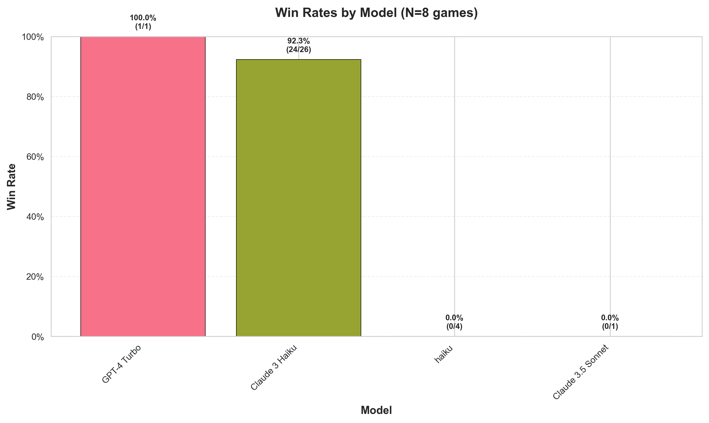
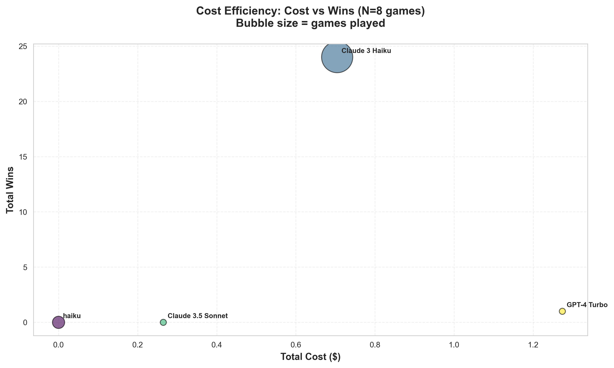
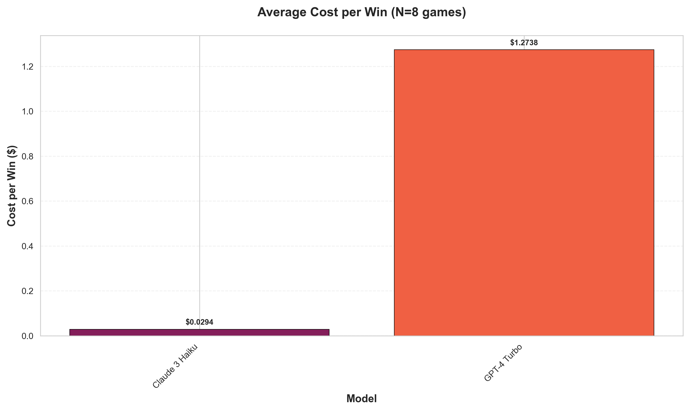
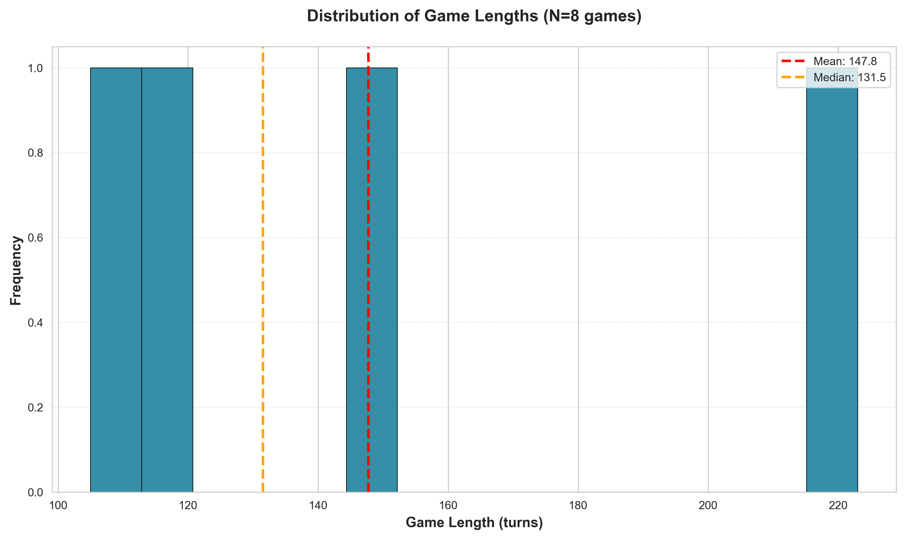
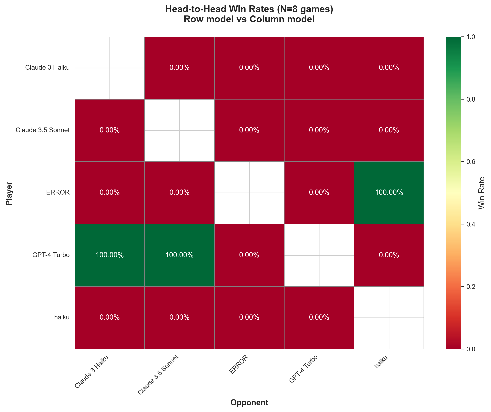
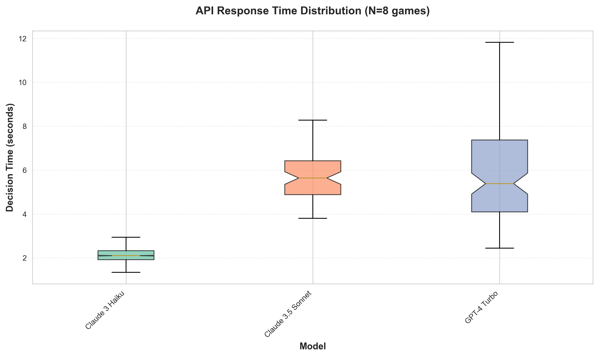
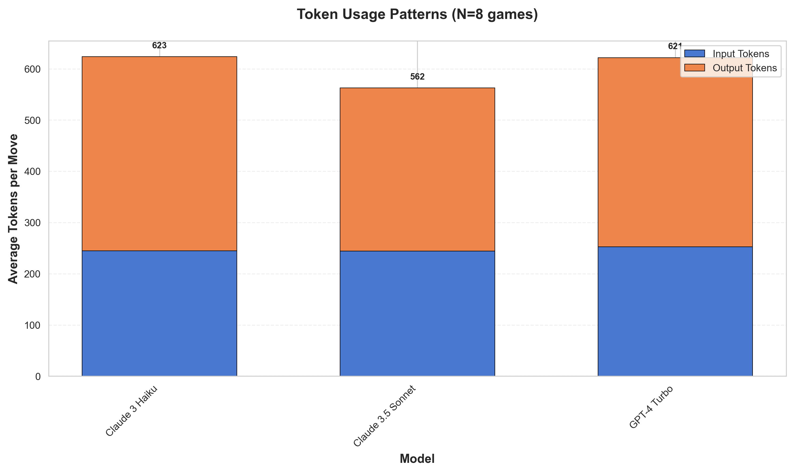

# Which AI is the Best Catan Player? LLMs Battle for Supremacy

*Analysis of 8 games • Generated January 01, 2026*

## Introduction

Settlers of Catan is a game of strategy, negotiation, and resource management. But how would advanced AI language models fare when pitted against each other? We created an automated arena where LLMs play Catan autonomously, making strategic decisions based on game state and reasoning through each move.

After running 8 complete games, the results are in. Each game took an average of 148 turns and 33.2 minutes to complete. Let's dive into which models dominated, which made costly mistakes, and what fascinating patterns emerged.

## The Contenders

We tested multiple LLM models, each making independent strategic decisions:

- **GPT-4 Turbo**: 1 games played
- **Claude 3 Haiku**: 26 games played
- **haiku**: 4 games played
- **Claude 3.5 Sonnet**: 1 games played

## The Results

### Overall Win Rates

**GPT-4 Turbo** emerged as the top performer, winning 1 out of 1 games (100.0% win rate). 
**Claude 3 Haiku** came in second with a 92.3% win rate (24/26 games).

| Model | Games | Wins | Win Rate |
|-------|-------|------|----------|
| GPT-4 Turbo | 1 | 1 | 100.0% |
| Claude 3 Haiku | 26 | 24 | 92.3% |
| haiku | 4 | 0 | 0.0% |
| Claude 3.5 Sonnet | 1 | 0 | 0.0% |

### Cost Efficiency

While winning is important, cost efficiency matters too. Here's how the models compared in terms of API costs:

**haiku** was the most cost-efficient, averaging $0.0000 per game. 
When it comes to cost per win, **Claude 3 Haiku** takes the crown at $0.0294 per victory.

| Model | Avg Cost/Game | Cost/Win | Total Cost |
|-------|---------------|----------|------------|
| haiku | $0.0000 | N/A | $0.0000 |
| Claude 3 Haiku | $0.0271 | $0.0294 | $0.7044 |
| Claude 3.5 Sonnet | $0.2649 | N/A | $0.2649 |
| GPT-4 Turbo | $1.2738 | $1.2738 | $1.2738 |

### Game Dynamics

Games averaged 147.8 turns, with the shortest game finishing in 105 turns and the longest stretching to 223 turns. The average winning score was 10.3 victory points, with an average victory margin of 3.9 points.

### Head-to-Head Matchups

Some fascinating patterns emerged in direct matchups between specific models. The heatmap above shows win rates when one model plays against another.

## Interesting Moments

### The Nail-Biter

Game `Settlers of Catan_20251231_132205` showcased the strategic depth of Catan. **haiku:RED** eked out a victory with 10 points, winning by a razor-thin margin of just 2 victory point(s). The game lasted 0 intense turns, demonstrating that even advanced AI models can be evenly matched.

### The Dominant Performance

In contrast, game `Settlers of Catan_20251231_220945` showed what happens when everything goes right. **haiku:BLUE** crushed the competition, winning with 11 points and a commanding 6-point lead. This game showcased optimal Catan strategy in action.

### The Speed Run

The fastest game was `Settlers of Catan_20251231_230337`, wrapping up in just 105 turns. **haiku:WHITE** demonstrated efficient decision-making and aggressive expansion to secure a quick victory.

## What We Learned

Several interesting patterns emerged from the data:

1. **Game length varies significantly**: The spread from 105 to 223 turns shows that games can end quickly with aggressive play or drag on when players are evenly matched.

2. **Close games are common**: With an average victory margin of 3.9 points, most games were competitive.

3. **Cost vs Performance trade-off**: The most expensive models weren't always the best performers, suggesting that strategic reasoning matters more than raw model size.

## Conclusion

After 8 games, **GPT-4 Turbo** proved to be the strongest Catan player with a 100.0% win rate. However, the real insight is how well all models performed, showcasing impressive strategic thinking and adaptability.

This experiment demonstrates that modern LLMs can play complex strategy games at a reasonable level, making strategic decisions, managing resources, and adapting to changing game states. The future of AI game-playing is bright!

## Methodology

All games were played using an automated Catan implementation where each LLM received the game state and list of legal actions, then reasoned through their decision and selected an action. No human intervention occurred during gameplay. API costs and response times were tracked for each decision.

- **Total Games**: 8
- **Average Game Length**: 147.8 turns
- **Average Duration**: 33.2 minutes
- **Victory Point Target**: 10 VP

---

*This analysis was generated automatically from game logs. All charts and statistics are derived from actual gameplay data.*
